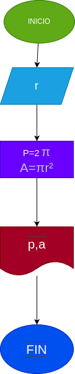

# Programa numero 1
Programa para calcular el área y el perímetro de un circulo de radio r

# Analisis 

## Input
### Variables de entrada
r: radio del circulo
### Processing
p: perimetro del circulo
p=2πr

a: area del circulo

a=πr²

### output
a,p

# Diseño

# Construcción
